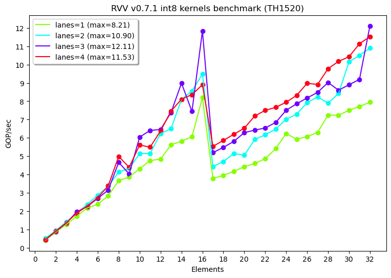

## High performance RVV kernel generator to C & LLVM-IR dialects

  This is a C/LLVM-IR kernel generator that address unsupported RVV ISA versions for LLVM or any other toolchains.

### Benchmark




### Usage

* Prepare a docker image with rv64 cross compiler
```
$ git clone https://github.com/cbalint13/rvv-kernels
$ cd rvv-kernels
$ docker build --file Dockerfile.ML.fedora --tag th1520-rvv .
```

* Generate a kernel
```
$ docker run -it --rm -v "$PWD":/opt/src th1520-rvv bash
[root@b8032fd28a75 src]# ./make.sh 32 4 int8 v0.7.1 cbalint@192.168.1.45

(x) Naive kernel:
  HEX = b0 28 00 00 b0 66 00 00 b0 a4 00 00 b0 e2 00 00
  O[] = 00010416 00026288 00042160 00058032

(x) MACC operations: elems[32] x lanes[4] = 256 Ops

(x) RVV kernel:
  HEX = b0 28 00 00 b0 66 00 00 b0 a4 00 00 b0 e2 00 00
  O[] = 00010416 00026288 00042160 00058032

RVV bench: 25.600 GOPS in 2.215818 secs
RVV speed: 11.553 GOPS/sec

[root@b8032fd28a75 src]# ls -l dot_int8_kernel.*
-rw-r--r-- 1 1000 1000 3867 Mar 13 18:03 dot_int8_kernel.c
-rw-r--r-- 1 1000 1000 5034 Mar 13 18:03 dot_int8_kernel.ir
```

* Optional benchmark logs & graph
```
[root@b8032fd28a75 src]# ./script/0-explore.sh
[root@b8032fd28a75 src]# ls -l benchmark-int8.log
-rw-r--r-- 1 1000 1000 5731 Mar 13 17:38 benchmark-int8.log

[root@b8032fd28a75 src]# ./script/1-plotgraph.py --logs benchmark-int8.log --title 'RVV v0.7.1 int8 kernels benchmark (TH1520)'
[root@b8032fd28a75 src]# ls -l benchmark-int8.log.png
-rw-r--r-- 1 1000 1000 58380 Mar 13 18:47 benchmark-int8.log.png
```


### Notes

  * This generator emmits C / LLVM-IR kernels, with encoded insn, thus making it RVV version agnostic
  * T-Head 1520 (C906, also others) implements older v0.7.1 RVV vector ISA, unsupported by LLVM upstream
  * TH1520 ```setvli``` ASIC implementation is slow, see comments on a dynamic kernel: [trials/riscv-asm.c](trials/riscv-asm.c)
  * The ```setvli``` slowness issue force the SVE (scalable vector) concept to avoid frequent ```setvli``` calls

  The [trials/riscv-asm.c](trials/riscv-asm.c) sample kernel would cope with **SVE concept** of **runtime dynamism**
but for reasons tested and mentioned here, on the particular T-Head's C906 RVV ASIC implementation, the context
switching ```setvli``` drags down the whole performance in a severe way, thus ```setvli``` calls should be minimized
for this particular target.
  
  For RVV 0.7.1 there is a limit of how & which vector registers can be used in the context of MUL (multiplier),
so the maximum vector fill width of 64 x ```int8``` being reduced into x2 lanes is not possible, it would require
**e8/m4** MUL mode that leaves room for only 4 x vregs (v0, v8, v16, v24) a insufficient amount of registers.
The maximum usable ```int8``` elements width is 32 for RVV 0.7.1 version.

  The generated kernel sets```setvli``` once and unrolls computations across the vector registers.


### Changelog

  * **13 Mar 2024** intial realease, for now ```int8``` with RVV 0.7.1 version
